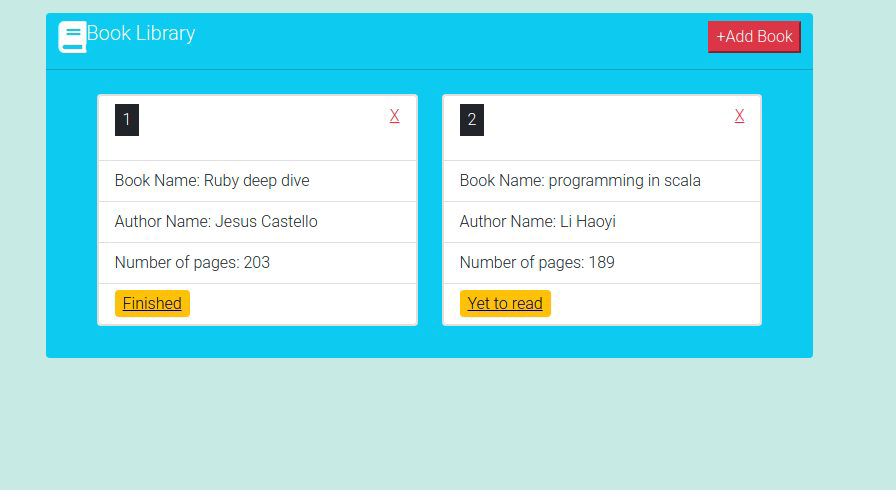

# PROJECT: LIBRARY

This project is a simple library where an user can add or remove books that have title, author, number of pages and read status. 
The follwing things have been practiced here:
- DOM Manipulation with JavaScript
- Use of JavaScript functions and loops

## Live Demo:
[My Library]()

## Screen-shots:


## Built-With

- HTML5
- CSS3
- JavaScript
- VScode

## Getting Started

**To get this project set up on your local machine, follow these simple steps:**

1. Open Terminal.
2. Navigate to your desired location to download the contents of this repository.
3. Copy and paste the following code into the Terminal: git clone https://github.com/enaburekhan/Book-Library.git
4. Run ```cd Book-Library```.

## Author Details::

👤 **Oyeleke Ayomide**

- Github: [@Haywhizzz](https://github.com/Haywhizzz )
- Twitter: [@Haywhizzz](https://twitter.com/Haywhizzz)
- Linkedin: [Haywhizzz](https://www.linkedin.com/in/oyeleke-ayomide-b962421a6/)

👤 **Eric Enaburekhan**

- Github: [@enaburekhan](https://github.com/enaburekhan)
- Twitter: [@enaburekhaneric](https://twitter.com/enaburekhaneric)
- Linkedin: [@ericenaburekhan](https://www.linkedin.com/in/eric-enaburekhan-801a28100/)


## Show your support

Give ⭐ Star me on GitHub — it helps!

## 📝 License

This project is [MIT](lic.url) licensed.   